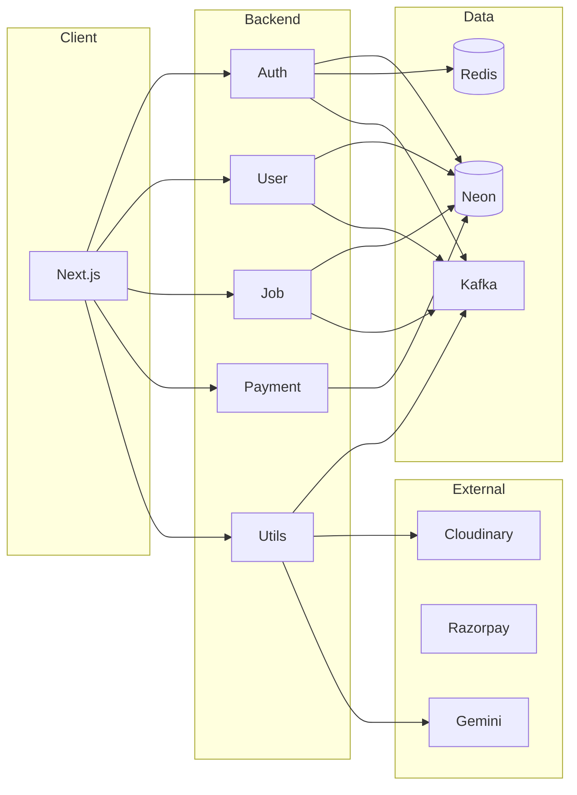

# NextHire

**Full-stack job portal** — job seekers discover roles, apply, and get AI career guidance; recruiters post jobs and manage candidates. Next.js frontend + **5 microservices** (Auth, User, Job, Payment, Utils), event-driven with Kafka, serverless Postgres (Neon).

---

## Why it stands out

- **Microservices** — Auth, User, Job, Payment, Utils; JWT, Redis, Kafka for events
- **AI** — Gemini-powered career suggestions and resume insights
- **Payments & storage** — Razorpay subscriptions; Cloudinary for resumes and images
- **Modern stack** — Next.js 16, React 19, Express 5, TypeScript end-to-end

---

## Architecture



---

## Tech stack

| Layer     | Tech |
|----------|------|
| Frontend | Next.js 16, React 19, TypeScript, Tailwind, Radix UI |
| Backend  | Express 5, JWT, Redis, Kafka |
| Data     | Neon (Postgres) |
| External | Cloudinary, Razorpay, Google Gemini, Nodemailer |

---

## Run locally

```bash
git clone https://github.com/AJKakarot/NextHire.git && cd NextHire
```

Add `.env` in `frontend/` and each `services/*/` (see env vars in repo). Then:

```bash
# Backend (5 services: auth, user, job, payment, utils)
cd services/auth && npm i && npm run dev   # repeat for user, job, payment, utils

# Frontend
cd frontend && npm i && npm run dev
```

Open **http://localhost:3000**. Requires Node 18+, Neon, Redis, Kafka, and API keys (Cloudinary, Razorpay, Gemini) configured per service.

---

## Project layout

```
NextHire/
├── frontend/          # Next.js (App Router), pages, components, context
└── services/
    ├── auth/          # Register, login, JWT, forgot/reset, Redis
    ├── user/          # Profile, skills, resume, profile pic
    ├── job/           # Jobs, companies, applications
    ├── payment/       # Razorpay subscription
    └── utils/         # Upload (Cloudinary), career API (Gemini), email consumer
```

---

*License: ISC*
