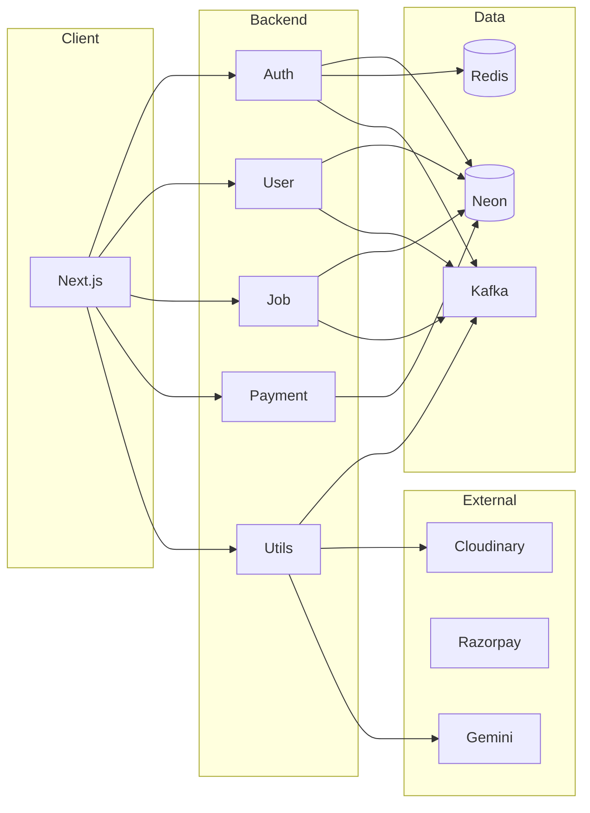

# NextHire

**Full-stack job portal** — job seekers discover roles, apply, and get AI career guidance; recruiters post jobs and manage candidates. Next.js frontend + **5 microservices** (Auth, User, Job, Payment, Utils), event-driven with Kafka, serverless Postgres (Neon).

---

## Why it stands out

- **Microservices** — Auth, User, Job, Payment, Utils; JWT, Redis, Kafka for events
- **AI** — Gemini-powered career suggestions and resume insights
- **Payments & storage** — Razorpay subscriptions; Cloudinary for resumes and images
- **Modern stack** — Next.js 16, React 19, Express 5, TypeScript end-to-end

---

## Architecture



---

## Features

### Job seekers

- Browse and filter jobs; view company profiles and open positions
- Apply to jobs; track application status in account
- Resume analyzer — ATS-style score and improvement suggestions
- AI career guide — personalized path and skills (Gemini)
- Profile: name, phone, bio, resume, skills, subscription

### Recruiters

- Post and update job listings; create and manage companies
- View and update application status for each job

### Platform

- Auth: register, login, forgot/reset password (email)
- Payments: subscription via Razorpay
- File uploads: resume and profile images (Cloudinary)
- Email: notifications (Nodemailer)
- Dark/light theme (system-aware)

---

## Tech stack

| Layer     | Tech |
|----------|------|
| Frontend | Next.js 16, React 19, TypeScript, Tailwind, Radix UI, Axios, next-themes |
| Backend  | Express 5, JWT, bcrypt, Redis, Kafka (KafkaJS) |
| Data     | Neon (serverless Postgres) |
| External | Cloudinary, Razorpay, Google Gemini, Nodemailer |

---

## API overview

| Service  | Main endpoints / purpose |
|----------|--------------------------|
| **Auth** | `POST /register`, `POST /login`, `POST /forgot`, `POST /reset/:token` |
| **User** | `GET /api/user/me`, update profile, resume, profile pic, skills |
| **Job**  | `GET /all`, `GET /:jobId`, `POST /new`, companies, applications CRUD |
| **Payment** | Create order, verify payment, success callback |
| **Utils** | `POST /upload` (Cloudinary), `POST /career` (Gemini), email via Kafka consumer |

Authenticated requests use `Authorization: Bearer <token>`. Frontend base URLs come from env (e.g. `NEXT_PUBLIC_AUTH_SERVICE`, `NEXT_PUBLIC_JOB_SERVICE`).

---

## Project layout

```
NextHire/
├── frontend/
│   ├── src/
│   │   ├── app/           # Routes: /, /jobs, /company, /account, /subscribe, auth, payment
│   │   ├── components/    # UI, hero, job-card, resume-analyser, career-guide, navbar
│   │   ├── context/      # AppContext (user, auth, API base URLs)
│   │   ├── lib/          # utils
│   │   └── type.ts       # Shared types
│   └── package.json
└── services/
    ├── auth/             # Register, login, JWT, forgot/reset, Redis
    ├── user/             # Profile, skills, resume, profile pic
    ├── job/              # Jobs, companies, applications
    ├── payment/          # Razorpay subscription
    └── utils/            # Upload (Cloudinary), career API (Gemini), email consumer
```

---

## Prerequisites

- **Node.js** 18+
- **Neon** account (Postgres)
- **Redis** (auth session/tokens)
- **Kafka** (e.g. local or Confluent)
- **Cloudinary**, **Razorpay**, **Google AI (Gemini)** API keys

---

## Environment variables

Each app uses `.env` (do not commit secrets). Example shape:

**Frontend** (`frontend/.env.local`):

```env
NEXT_PUBLIC_UTILS_SERVICE=http://localhost:5001
NEXT_PUBLIC_AUTH_SERVICE=http://localhost:5000
NEXT_PUBLIC_USER_SERVICE=http://localhost:5002
NEXT_PUBLIC_JOB_SERVICE=http://localhost:5003
NEXT_PUBLIC_PAYMENT_SERVICE=http://localhost:5004
```

**Services** — each has its own `.env`: DB URL (Neon), JWT secret (auth), Redis URL (auth), Kafka brokers, and per-service keys (Cloudinary, Razorpay, Gemini, Nodemailer in utils). See service folders for expected variable names.

---

## Run locally

**1. Clone**

```bash
git clone https://github.com/AJKakarot/NextHire.git
cd NextHire
```

**2. Backend (5 services)**

Run each in its own terminal (or use a process manager). Ensure Kafka and Redis are running.

```bash
cd services/auth    && npm install && npm run dev   # e.g. port 5000
cd services/user    && npm install && npm run dev   # e.g. port 5002
cd services/job     && npm install && npm run dev   # e.g. port 5003
cd services/payment && npm install && npm run dev   # e.g. port 5004
cd services/utils   && npm install && npm run dev   # e.g. port 5001
```

**3. Frontend**

```bash
cd frontend
npm install
npm run dev
```

Open **http://localhost:3000**.

**4. Production build**

- Frontend: `npm run build` then `npm start`
- Each service: `npm run build` then `npm start`

---

## Scripts

| Location   | Command        | Description        |
|------------|----------------|--------------------|
| Frontend   | `npm run dev`   | Next.js dev server |
| Frontend   | `npm run build` | Production build   |
| Frontend   | `npm start`    | Run production     |
| Any service | `npm run dev`  | TypeScript watch   |
| Any service | `npm run build`| Compile to `dist`  |
| Any service | `npm start`    | Run `dist/index.js`|

---

## Docker

Each service and the frontend have a `Dockerfile`. Use your own orchestration (e.g. `docker compose`); ensure Neon, Redis, and Kafka are reachable and env vars are set per service.

---

*License: ISC*
