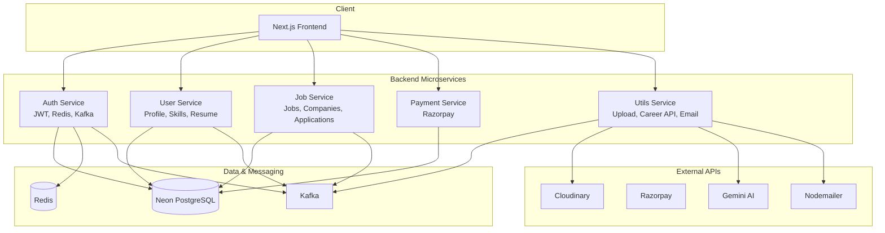

# NextHire
# Job Portal

A full-stack **job portal** where job seekers discover roles, manage applications, and get AI-powered career guidance—and recruiters post jobs and manage candidates. Built with a **microservices** backend and a modern **Next.js** frontend.

---

## Features

### For Job Seekers
- **Browse jobs** — Search and filter active job listings
- **Company profiles** — View company details and open positions
- **Apply to jobs** — Submit applications and track status
- **Resume analyzer** — Get ATS-style scores and improvement suggestions
- **AI career guide** — Personalized career path and skill recommendations (powered by Gemini)
- **Account & profile** — Update profile, resume, skills, and subscription

### For Recruiters
- **Post jobs** — Create and update job listings
- **Manage companies** — Create companies and attach jobs
- **Applications** — View and update application status for each job

### Platform
- **Auth** — Register, login, forgot/reset password with email
- **Payments** — Subscription flows via Razorpay
- **File uploads** — Resume and profile images (Cloudinary)
- **Email** — Notifications (Nodemailer)
- **Dark/Light theme** — System-aware theme toggle

---

## Architecture

Two views of the system: **high-level components** and **request/data flow**—useful for SDE interviews and onboarding.

### 1. High-level system architecture



### 2. Request flow: SDE applies to job (sequence)

End-to-end path when a job seeker applies to a role—shows how frontend, auth, user, and job services interact.

```mermaid
sequenceDiagram
    participant U as User (Browser)
    participant FE as Next.js Frontend
    participant AUTH as Auth Service
    participant USER as User Service
    participant JOB as Job Service
    participant DB as Neon PostgreSQL

    U->>FE: Visit /jobs, click Apply
    FE->>FE: JWT from cookie / AppContext
    FE->>JOB: POST /apply (Bearer JWT)
    JOB->>AUTH: Validate token (or decode JWT)
    AUTH-->>JOB: user_id
    JOB->>DB: Insert application (user_id, job_id)
    JOB-->>FE: 201 Application created
    FE-->>U: Success; update Applied Jobs

    Note over U,DB: Profile & resume already set via User Service
    U->>FE: /account (view applied jobs)
    FE->>USER: GET /api/user/me (Bearer JWT)
    USER-->>FE: user + profile
    FE->>JOB: GET applications for user
    JOB-->>FE: List of applied jobs + status
    FE-->>U: Show Applied Jobs tab
```

**Why these two diagrams help (SDE role):**

| Diagram | Use case |
|--------|----------|
| **1. High-level** | Explains system boundaries, which service owns what, and how data (Neon, Redis, Kafka) and external APIs (Cloudinary, Razorpay, Gemini) are used. |
| **2. Request flow** | Explains one critical path (apply to job + view applications), including auth, service calls, and DB writes—good for debugging and feature changes. |

---

## Flow structure for SDE role (Job seeker)

End-to-end journey for a Software Development Engineer using the portal:

```
┌─────────────────────────────────────────────────────────────────────────────┐
│ 1. LAND & DISCOVER                                                           │
│    /  →  Hero, Career Guide (AI), Resume Analyzer                             │
│    • Explore platform value before signing up                                 │
│    • Get skill-based career suggestions (Gemini)                             │
│    • Check resume ATS score & suggestions                                     │
└─────────────────────────────────────────────────────────────────────────────┘
                                    │
                                    ▼
┌─────────────────────────────────────────────────────────────────────────────┐
│ 2. AUTHENTICATE                                                              │
│    /register  →  /login  (or /forgot → /reset/:token)                         │
│    • Register as jobseeker (name, email, password, role, resume optional)     │
│    • Login → JWT stored (cookie); user + isAuth in AppContext                  │
└─────────────────────────────────────────────────────────────────────────────┘
                                    │
                                    ▼
┌─────────────────────────────────────────────────────────────────────────────┐
│ 3. PROFILE & READINESS                                                        │
│    /account  →  Info | Skills | Resume | Company (if recruiter)               │
│    • Complete profile: name, phone, bio                                       │
│    • Add/update skills (used for career guide & job match)                    │
│    • Upload/update resume (Cloudinary) for applications                        │
│    • (Optional) /subscribe → Razorpay → premium features                       │
└─────────────────────────────────────────────────────────────────────────────┘
                                    │
                                    ▼
┌─────────────────────────────────────────────────────────────────────────────┐
│ 4. FIND SDE JOBS                                                             │
│    /jobs  →  Filter by title (e.g. "SDE", "Software Engineer") & location     │
│    • GET /api/job/all?title=...&location=...                                  │
│    • Browse job cards → click to /jobs/[id]                                   │
└─────────────────────────────────────────────────────────────────────────────┘
                                    │
                                    ▼
┌─────────────────────────────────────────────────────────────────────────────┐
│ 5. JOB DETAIL & APPLY                                                        │
│    /jobs/[id]  →  Company, role, salary, description                          │
│    • Apply (if not already applied) → creates application record              │
│    • Recruiter view: list applications, update status                         │
└─────────────────────────────────────────────────────────────────────────────┘
                                    │
                                    ▼
┌─────────────────────────────────────────────────────────────────────────────┐
│ 6. TRACK APPLICATIONS                                                        │
│    /account  →  Applied jobs tab                                              │
│    • View all applied jobs and status                                         │
│    • Company pages: /company/[id] for more roles at same company               │
└─────────────────────────────────────────────────────────────────────────────┘
```

### SDE flow summary

| Step | Route / action        | Service(s)     | Outcome                          |
|------|------------------------|----------------|----------------------------------|
| 1    | `/`                    | Utils (career, resume analysis) | Discover value, AI guidance   |
| 2    | `/register`, `/login`  | Auth           | JWT, session; user in context    |
| 3    | `/account`             | User           | Profile, skills, resume ready    |
| 4    | `/jobs` (filter)       | Job            | List SDE (or other) roles        |
| 5    | `/jobs/[id]` → Apply   | Job            | Application created              |
| 6    | `/account` (Applied)   | Job + User     | Track status; visit company page |

---

## Tech Stack

| Layer        | Technologies |
|-------------|--------------|
| **Frontend** | Next.js 16, React 19, TypeScript, Tailwind CSS, Radix UI, Axios, next-themes |
| **Auth**    | JWT, bcrypt, Redis (session/tokens), Neon (PostgreSQL) |
| **APIs**    | Express 5, TypeScript, CORS |
| **Data**    | Neon (serverless Postgres) |
| **Messaging** | Kafka (KafkaJS) — service-to-service events |
| **Payments** | Razorpay |
| **Storage** | Cloudinary (images, resumes) |
| **AI**      | Google Gemini (career suggestions) |
| **Email**   | Nodemailer |

---

## Project Structure

```
job-portal/
├── frontend/                 # Next.js app (App Router)
│   ├── src/
│   │   ├── app/              # Routes: /, /jobs, /company, /account, /subscribe, /payment, auth
│   │   ├── components/       # UI, hero, job-card, resume-analyser, carrer-guide, navbar, etc.
│   │   ├── context/          # AppContext (user, auth, API base URLs)
│   │   ├── lib/              # utils
│   │   └── type.ts           # Shared TS types
│   └── package.json
├── services/
│   ├── auth/                 # Register, login, forgot/reset password, JWT, Redis
│   ├── user/                 # User profile, resume, skills, profile pic
│   ├── job/                  # Jobs, companies, applications
│   ├── payment/              # Razorpay subscription & success handling
│   └── utils/                # Cloudinary upload, Gemini career API, email (Kafka consumer)
├── README.md
└── (optional) docker-compose  # If you add one for local run
```

---

## Prerequisites

- **Node.js** 18+ and npm/yarn/pnpm
- **Docker** (optional, for Kafka/Redis or full stack)
- **Neon** account (PostgreSQL)
- **Cloudinary** account (uploads)
- **Razorpay** account (payments)
- **Google AI (Gemini)** API key
- **Kafka** (e.g. local or Confluent) for service events
- **Redis** (for auth service)

---

## Environment Variables

Each service and the frontend use `.env` (do not commit secrets). Example shape:

### Frontend (`frontend/.env.local`)

```env
# Point to your backend services (e.g. http://localhost:PORT)
NEXT_PUBLIC_UTILS_SERVICE=http://localhost:5001
NEXT_PUBLIC_AUTH_SERVICE=http://localhost:5000
NEXT_PUBLIC_USER_SERVICE=http://localhost:5002
NEXT_PUBLIC_JOB_SERVICE=http://localhost:5003
NEXT_PUBLIC_PAYMENT_SERVICE=http://localhost:5004
```

### Auth (`services/auth/.env`)

- DB connection (Neon), JWT secret, Redis URL, Kafka brokers, etc.

### User (`services/user/.env`)

- Neon DB, Kafka, JWT/public key or auth service URL for validation

### Job (`services/job/.env`)

- Neon DB, Kafka, auth validation

### Payment (`services/payment/.env`)

- Neon DB, Razorpay key/secret, auth validation

### Utils (`services/utils/.env`)

- Cloudinary credentials, Gemini API key, Kafka (consumer), Nodemailer config

Create `.env` (or `.env.example` without secrets) in each folder and fill values for your environment.

---

## Getting Started

### 1. Clone and install

```bash
git clone <repo-url>
cd job-portal
```

### 2. Run backend services

Each service runs independently. From the repo root:

```bash
# Auth (e.g. port 5000)
cd services/auth && npm install && npm run dev

# User (e.g. port 5002)
cd services/user && npm install && npm run dev

# Job (e.g. port 5003)
cd services/job && npm install && npm run dev

# Payment (e.g. port 5004)
cd services/payment && npm install && npm run dev

# Utils (e.g. port 5001) — uploads, career API, email consumer
cd services/utils && npm install && npm run dev
```

Use separate terminals (or a process manager) so all five are running. Ensure Kafka and Redis are up for auth/utils (and any service that publishes/consumes events).

### 3. Run the frontend

```bash
cd frontend
npm install
npm run dev
```

Open [http://localhost:3000](http://localhost:3000).

### 4. Build for production

**Frontend**

```bash
cd frontend
npm run build
npm start
```

**Services**

```bash
cd services/<service-name>
npm run build
npm start
```

---

## Docker

Each service and the frontend have a `Dockerfile`. Build and run with your own orchestration (e.g. `docker compose`), and ensure Kafka, Redis, and Neon are reachable from the containers. Configure env vars for each service in your compose or deployment.

---

## API Overview

| Service  | Purpose |
|----------|---------|
| **Auth** | `POST /register`, `POST /login`, `POST /forgot`, `POST /reset/:token` |
| **User** | `GET /api/user/me`, update profile, resume, profile pic, skills |
| **Job**  | `GET /all`, `GET /:jobId`, `POST /new`, companies, applications CRUD |
| **Payment** | Create order, verify payment, success callback |
| **Utils** | `POST /upload` (Cloudinary), `POST /career` (Gemini), email via Kafka consumer |

Frontend uses these base URLs from env (or from `AppContext` if set in code). All authenticated requests send `Authorization: Bearer <token>`.

---

## Scripts

| Location     | Command      | Description        |
|-------------|-------------|--------------------|
| Frontend    | `npm run dev`  | Next.js dev server |
| Frontend    | `npm run build`| Production build   |
| Frontend    | `npm start`    | Run production     |
| Any service | `npm run dev`  | TypeScript watch + nodemon |
| Any service | `npm run build`| `tsc` compile      |
| Any service | `npm start`    | Run `dist/index.js`|

---

## License

ISC (or your chosen license).
