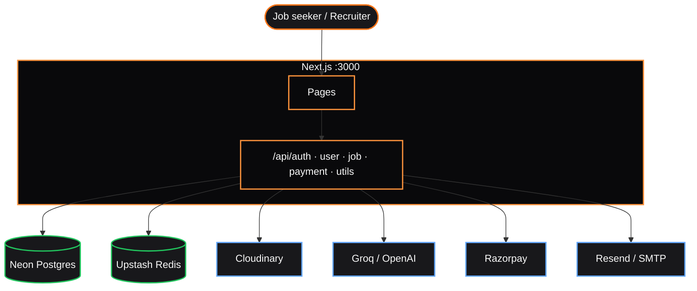

# NextHire

Analyze a resume with AI, get an ATS score, then find and apply to jobs — or hire as a recruiter. One **Next.js** app. UI and APIs share the same process.

**Live:** [nexthires.app](https://nexthires.app) · **Repo:** [AJKakarot/next-hires](https://github.com/AJKakarot/next-hires)

---

## What it does

**Job seekers**
- Drop a PDF on the home pipeline and get an ATS score, breakdown, strengths, and fixes
- Optional **Gemini/Groq polish** against a target title and job description
- Career guide from your skills (roles, what to learn, 30/60/90-day plan)
- Browse jobs, apply in one click, track applications

**Recruiters**
- Create companies and post roles
- Review applicants and update status

**Platform**
- Register / login / forgot-reset (JWT + email)
- Cloudinary uploads for resumes and photos
- Razorpay subscriptions
- Resend email, or Gmail SMTP if no Resend key

---

## Stack

| Piece | Choice |
| --- | --- |
| App | Next.js 16, React 19, TypeScript, Tailwind CSS |
| API | Route Handlers under `/api/*` |
| Auth | JWT, bcrypt, Upstash Redis (reset tokens) |
| Database | Neon Postgres (tables created on first boot) |
| AI | Groq (`openai/gpt-oss-20b`) with OpenAI fallback |
| Files | Cloudinary |
| Pay | Razorpay |
| Mail | Resend or SMTP |

---

## Architecture

One Node process. No Express microservices, no Kafka, no inter-service HTTP.


```mermaid
flowchart TB
    classDef client fill:#18181B,stroke:#F97316,stroke-width:2px,color:#FAFAFA
    classDef app fill:#09090B,stroke:#FB923C,stroke-width:2px,color:#FAFAFA
    classDef data fill:#18181B,stroke:#22C55E,stroke-width:2px,color:#FAFAFA
    classDef ext fill:#18181B,stroke:#60A5FA,stroke-width:2px,color:#FAFAFA

    USERS(["Job seeker / Recruiter"]):::client

    subgraph APP["Next.js :3000"]
        UI["Pages"]
        API["/api/auth · user · job · payment · utils"]
        UI --> API
    end

    PG[("Neon Postgres")]:::data
    REDIS[("Upstash Redis")]:::data
    CLOUD["Cloudinary"]:::ext
    LLM["Groq / OpenAI"]:::ext
    RAZOR["Razorpay"]:::ext
    MAIL["Resend / SMTP"]:::ext

    USERS --> UI
    API --> PG
    API --> REDIS
    API --> CLOUD
    API --> LLM
    API --> RAZOR
    API --> MAIL

    class UI,API,APP app
```

| Prefix | Routes |
| --- | --- |
| `/api/auth` | register, login, forgot, reset |
| `/api/user` | me, profile, skills, resume, apply, applications |
| `/api/job` | companies, jobs, recruiter review |
| `/api/payment` | Razorpay order + verify |
| `/api/utils` | upload, resume proxy, career guide, resume analyser |

---

## Run locally

Need Node 18+, plus accounts for Neon, Cloudinary, Groq (or OpenAI), Upstash, and mail.

```bash
git clone https://github.com/AJKakarot/next-hires.git
cd next-hires
cp .env.example .env.local
npm install
npm run dev
```

Open [http://localhost:3000](http://localhost:3000).

```bash
npm run build && npm start   # production
npm run lint
```

---

## Environment

Copy `.env.example` → `.env.local`. Never commit `.env.local`.

```env
# App
APP_URL=http://localhost:3000
NEXT_PUBLIC_APP_URL=http://localhost:3000

# Postgres (Neon)
DB_URL=

# Auth
JWT_SEC=

# Redis — password reset
UPSTASH_REDIS_REST_URL=
UPSTASH_REDIS_REST_TOKEN=

# Email — Resend wins if RESEND_API_KEY is set
RESEND_API_KEY=
RESEND_FROM=NextHire <onboarding@resend.dev>
SMTP_USER=
SMTP_PASS=

# Cloudinary
CLOUD_NAME=
API_KEY=
API_SECRET=

# AI — Groq first, else OpenAI
GROQ_API_KEY=
GROQ_MODEL=openai/gpt-oss-20b
# OPENAI_API_KEY=
# OPENAI_MODEL=gpt-4o-mini

# Razorpay
Razorpay_Key=
Razorpay_Secret=
NEXT_PUBLIC_RAZORPAY_KEY=
```

On Vercel, add the same keys. Set `APP_URL` / `NEXT_PUBLIC_APP_URL` to the live origin (`https://nexthires.app` or `https://www.nexthires.app`).

---

## Deploy

**Vercel** is the intended host (Hobby is fine).

1. Import [AJKakarot/next-hires](https://github.com/AJKakarot/next-hires)
2. Paste env vars from `.env.example`
3. Deploy

Custom domain: apex `A` → Vercel, `www` `CNAME` → `cname.vercel-dns.com`. Then pick one as primary and redirect the other.

`render.yaml` is also in the repo if you prefer Render (one web service, `npm run build` / `npm start`).

---

## Layout

```
src/
  app/                 pages + /api route handlers
  components/          landing, analyzer, chrome, UI
  context/             session + profile actions
  lib/server/          db, jwt, mail, upload, llm, razorpay
public/
.env.example
```

---

## License

ISC · Built by [Ajeet Gupta](https://ajeetgupta.com)
