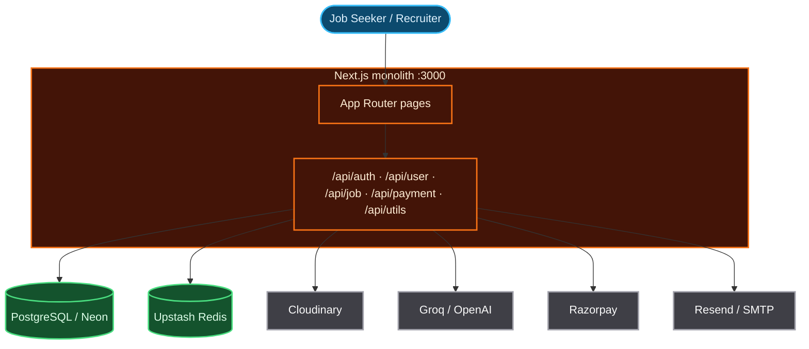

# NextHire

A full-stack **job portal** where job seekers discover roles, manage applications, and get AI-powered career guidance—and recruiters post jobs and manage candidates. Built as a **single Next.js** app: UI and APIs live together.

---

## Features

### For Job Seekers
- **Browse jobs** — Search and filter active job listings
- **Company profiles** — View company details and open positions
- **Apply to jobs** — Submit applications and track status
- **Resume analyzer** — Get ATS-style scores and improvement suggestions
- **AI career guide** — Personalized career path and skill recommendations (Groq or OpenAI)
- **Account & profile** — Update profile, resume, skills, and subscription

### For Recruiters
- **Post jobs** — Create and update job listings
- **Manage companies** — Create companies and attach jobs
- **Applications** — View and update application status for each job

### Platform
- **Auth** — Register, login, forgot/reset password with email
- **Payments** — Subscription flows via Razorpay
- **File uploads** — Resume and profile images (Cloudinary)
- **Email** — Notifications (Resend or Nodemailer)
- **Dark/Light theme** — System-aware theme toggle

---

## Tech Stack

| Layer | Technologies |
|-------|--------------|
| **App** | Next.js 16, React 19, TypeScript, Tailwind CSS, Radix UI |
| **API** | Next.js Route Handlers under `/api/*` |
| **Auth** | JWT, bcryptjs, Redis (reset tokens) |
| **Data** | Neon (PostgreSQL) |
| **Payments** | Razorpay |
| **Storage** | Cloudinary |
| **AI** | Groq or OpenAI |
| **Email** | Resend or Gmail SMTP |

---

## Architecture

One Next.js process serves the UI and all APIs. There are no separate Express services, Kafka, or cross-service HTTP hops. Uploads, AI, mail, and payments are called in-process.


```mermaid
flowchart TB
    classDef client fill:#0c4a6e,stroke:#38bdf8,stroke-width:2px,color:#e0f2fe
    classDef app fill:#431407,stroke:#f97316,stroke-width:2px,color:#ffedd5
    classDef data fill:#14532d,stroke:#4ade80,stroke-width:2px,color:#dcfce7
    classDef external fill:#3f3f46,stroke:#a1a1aa,stroke-width:2px,color:#fafafa

    USERS(["Job Seeker / Recruiter"]):::client

    subgraph APP["Next.js monolith :3000"]
        UI["App Router pages"]
        API["/api/auth · /api/user · /api/job · /api/payment · /api/utils"]
        UI --> API
    end

    PG[("PostgreSQL / Neon")]:::data
    REDIS[("Upstash Redis")]:::data
    CLOUD["Cloudinary"]:::external
    GEMINI["Groq / OpenAI"]:::external
    RAZOR["Razorpay"]:::external
    SMTP["Resend / SMTP"]:::external

    USERS --> UI
    API --> PG
    API --> REDIS
    API --> CLOUD
    API --> GEMINI
    API --> RAZOR
    API --> SMTP

    class UI,API,APP app
```

### API map

| Prefix | Purpose |
|--------|---------|
| `/api/auth` | Register, login, forgot, reset |
| `/api/user` | Profile, skills, resume, apply, applications |
| `/api/job` | Companies, jobs, recruiter application review |
| `/api/payment` | Razorpay checkout and verify |
| `/api/utils` | Upload, resume proxy, career guide, resume analyser |

---

## Project Structure

```
next-hire-platform/
├── src/
│   ├── app/                 # Pages + Route Handlers
│   │   ├── api/             # Auth, user, job, payment, utils
│   │   ├── (auth)/          # login, register, forgot, reset
│   │   ├── account/
│   │   ├── jobs/
│   │   └── ...
│   ├── components/
│   ├── context/             # AppContext (session + profile actions)
│   └── lib/server/          # DB, JWT, mail, Cloudinary, Groq/OpenAI, Razorpay
├── public/
├── package.json
└── .env.example
```

---

## Prerequisites

- **Node.js** 18+
- **Neon** account (PostgreSQL)
- **Cloudinary** account
- **Razorpay** account
- **Groq** or **OpenAI** API key
- **Upstash Redis** (password reset)
- **Resend** or Gmail SMTP

---

## Environment Variables

Copy `.env.example` to `.env.local` and fill values:

```env
APP_URL=http://localhost:3000
DB_URL=
JWT_SEC=
UPSTASH_REDIS_REST_URL=
UPSTASH_REDIS_REST_TOKEN=
RESEND_API_KEY=
SMTP_USER=
SMTP_PASS=
CLOUD_NAME=
API_KEY=
API_SECRET=
GROQ_API_KEY=
Razorpay_Key=
Razorpay_Secret=
NEXT_PUBLIC_RAZORPAY_KEY=
```

---

## Getting Started

```bash
npm install
npm run dev
```

Open [http://localhost:3000](http://localhost:3000).

Tables are created automatically on first server start.

### Production

```bash
npm run build
npm start
```

---

## License

ISC
